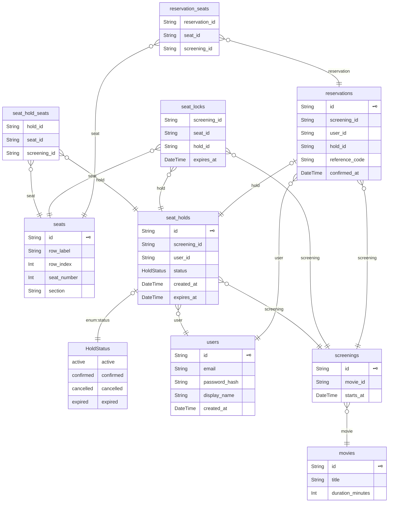

```mermaid
erDiagram

        HoldStatus {
            active active
confirmed confirmed
cancelled cancelled
expired expired
        }
    
  "users" {
    String id "🗝️"
    String email 
    String password_hash 
    String display_name 
    DateTime created_at 
    }
  

  "movies" {
    String id "🗝️"
    String title 
    Int duration_minutes 
    }
  

  "screenings" {
    String id "🗝️"
    String movie_id 
    DateTime starts_at 
    }
  

  "seats" {
    String id "🗝️"
    String row_label 
    Int row_index 
    Int seat_number 
    String section 
    }
  

  "seat_holds" {
    String id "🗝️"
    String screening_id 
    String user_id 
    HoldStatus status 
    DateTime created_at 
    DateTime expires_at 
    }
  

  "seat_hold_seats" {
    String hold_id 
    String seat_id 
    String screening_id 
    }
  

  "seat_locks" {
    String screening_id 
    String seat_id 
    String hold_id 
    DateTime expires_at 
    }
  

  "reservations" {
    String id "🗝️"
    String screening_id 
    String user_id 
    String hold_id 
    String reference_code 
    DateTime confirmed_at 
    }
  

  "reservation_seats" {
    String reservation_id 
    String seat_id 
    String screening_id 
    }
  
    "screenings" }o--|| movies : "movie"
    "seat_holds" |o--|| "HoldStatus" : "enum:status"
    "seat_holds" }o--|| screenings : "screening"
    "seat_holds" }o--|| users : "user"
    "seat_hold_seats" }o--|| seat_holds : "hold"
    "seat_hold_seats" }o--|| seats : "seat"
    "seat_locks" }o--|| screenings : "screening"
    "seat_locks" }o--|| seats : "seat"
    "seat_locks" }o--|| seat_holds : "hold"
    "reservations" }o--|| screenings : "screening"
    "reservations" }o--|| users : "user"
    "reservations" |o--|| seat_holds : "hold"
    "reservation_seats" }o--|| reservations : "reservation"
    "reservation_seats" }o--|| seats : "seat"
```
